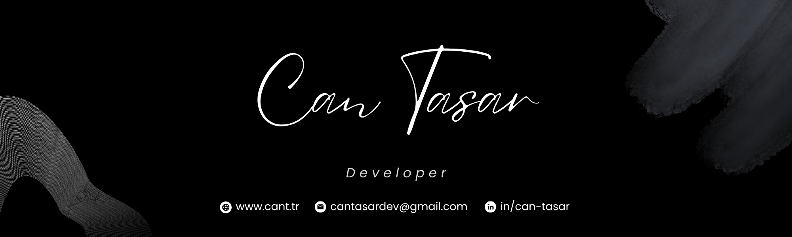
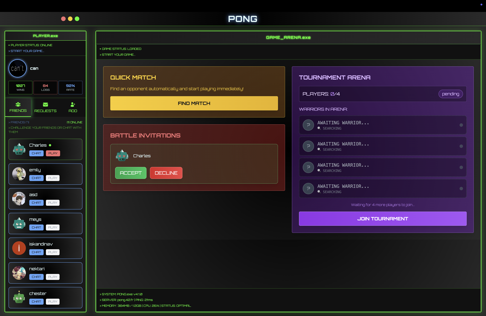

<h2 align="center">/cantasar</h2>

  

    
    
  

  

    
  

## 🚀 Projects

<table>
  <tr>
    <th>Project</th>
    <th>Description</th>
  </tr>
  <tr>
    <td><a href="https://github.com/cantasar/pong-game"><b>Multiplayer Pong Game Platform</b></a></td>
    <td>
        
      <em>Modern multiplayer Pong game with real-time gameplay, tournament system, and comprehensive social features on a production-ready gaming platform.</em>
         
      
         
      <b>Technologies:</b>
       
      • <b>Frontend:</b> TypeScript, Vanilla TS, <b>Babylon.js</b>, Tailwind CSS, WebSocket API 
      • <b>Backend:</b> Node.js, <b>Fastify</b>, SQLite, JWT, <b>Argon2</b>, OAuth2 
      • <b>3D Graphics:</b> Babylon.js rendering engine 
      • <b>Security:</b> XSS protection, CSRF, rate limiting, <b>2FA</b> 
      • <b>DevOps:</b> Docker, Docker Compose, <b>Nginx</b>, SSL 
      • <b>Monitoring:</b> <b>Prometheus</b>, Grafana 
       
      
       
      <b>Features Developed:</b> 
      • <b>Real-time multiplayer</b> game mechanics with physics engine 
      • <b>WebSocket-based synchronization</b> system for seamless gameplay 
      • Secure user authentication with JWT and <b>mandatory 2FA</b> 
      • <b>Automated tournament system</b> with bracket management 
      • Comprehensive user profiles and <b>friend network system</b> 
      • Production-ready <b>monitoring dashboard</b> with Grafana 
      • <b>Docker container orchestration</b> and deployment pipeline 
      • Multi-layered <b>security architecture</b> with XSS/CSRF protection 
      • Custom component system and <b>routing framework</b> 
      • <b>Google OAuth2 integration</b> for streamlined registration
    </td>
  </tr>
  <tr><td><a href="https://github.com/cantasar/Inception"><b>Inception</b></a></td>
    <td>
        
      <em>Built a custom multi-container Docker setup with NGINX, WordPress, and MariaDB, emphasizing security, automation, and maintainability.</em>
        
      <b>Technologies:</b> 
      • <b>Containerization:</b> Docker, Docker Compose 
      • <b>Web Server:</b> NGINX with <b>TLSv1.3</b> SSL configuration 
      • <b>Application:</b> WordPress with <b>PHP-FPM</b> 
      • <b>Database:</b> <b>MariaDB</b> with persistent volumes 
      • <b>Security:</b> SSL certificates, environment variables, container isolation 
       
      <b>Features Implemented:</b> 
      • <b>NGINX as single TLS entry point</b> on port 443 with SSL termination 
      • <b>Service isolation</b> with dedicated containers for each component 
      • <b>Environment-based configuration</b> management with Docker Compose 
      • <b>Custom Dockerfiles</b> for each service with security best practices 
      • <b>Persistent data storage</b> with Docker volumes for database 
      • <b>Network segmentation</b> and container communication 
      • <b>Scalable architecture</b> ready for production deployment 
    </td>
  </tr>
  <tr><td><a href="https://github.com/cantasar/IRC"><b>IRC Server</b></a></td>
    <td>
      <ul>
        <li><b>Real-time</b> chat server written in <b>C++</b></li>
        <li><b>Socket programming</b>, select(), IRC protocol</li>
      </ul>
    </td>
  </tr>
  <tr><td><a href="https://github.com/cantasar/cub3D"><b>Cub3D</b></a></td>
    <td>
      <ul>
        <li><b>3D raycasting engine</b> built in C</li>
        <li>Features <b>DDA</b>, collision detection, texture rendering</li>
      </ul>
    </td>
  </tr>
  <tr><td><a href="https://github.com/cantasar/cpp-modules"><b>CPP Modules</b></a></td>
    <td>
      <ul>
        <li>Advanced <b>C++</b> <b>OOP</b> topics</li>
        <li>Inheritance, Templates, Exceptions</li>
      </ul>
    </td>
  </tr>
  <tr><td><a href="https://github.com/cantasar/Dining-Philosophers-Problem"><b>Dining Philosophers</b></a></td>
    <td>
      <ul>
        <li><b>Multithreading</b> problem solved in C</li>
        <li>Using <b>pthread</b>, mutexes, deadlock avoidance</li>
      </ul>
    </td>
  </tr>
  <tr><td><a href="https://github.com/cantasar/minishell"><b>Minishell</b></a></td>
    <td>
      <ul>
        <li><b>Unix shell</b> interpreter in C</li>
        <li>Supports <b>fork()</b>, piping, parsing, env vars</li>
      </ul>
    </td>
  </tr>
  <tr><td><a href="https://github.com/cantasar/so_long"><b>So_long</b></a></td>
    <td>
      <ul>
        <li><b>2D game engine</b> with tile rendering</li>
        <li>Sprites, collectibles, <b>enemy AI</b></li>
      </ul>
    </td>
  </tr>
  <tr><td><a href="https://github.com/cantasar/push_swap"><b>Push Swap</b></a></td>
    <td>
      <ul>
        <li>Sorting stacks project</li>
        <li>Uses custom <b>radix sort</b> and minimal operation design</li>
      </ul>
    </td>
  </tr>

</table>

## 📫 Connect With Me
  
  
  
  
  
  

 
 
 

  

 
 

  <table>
    <tr>
      <td></td>
    </tr>
  </table>

