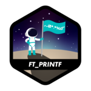
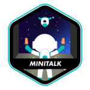
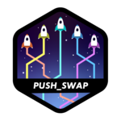
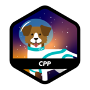
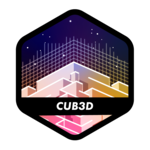

<h2 align="center">/cantasar</h2>

  
  

<!-- 

  
  
  
  
  
  
  
  
  
  

 -->

## 🚀 Projects

| Project | Description |
|---------|-------------|
| [IRC Server](https://github.com/cantasar/IRC) | **Goal:** Communication protocol that enables real-time messaging over TCP/IP:  - Managing authentication, usernames, and nicknames to ensure unique user identification. - Supporting channel creation and messaging between users within channels. - Implementing operator and regular user differentiation with specific privileges. - Providing operator commands such as KICK, INVITE, TOPIC, and MODE for channel moderation.  - Ensuring stability by preventing crashes and unexpected terminations.
| [EduManage](https://github.com/cantasar/EduManage) | **Goal:** Develop a backend solution to streamline the management of student records, courses, and enrollment processes. This project taught me about web backend development, database management, and implementing CRUD operations using ASP.NET Core and Entity Framework. - Built using **ASP.NET Core 8.0** for a robust backend - Managed database operations with **Entity Framework Core 8.0** and Code First migrations - Implemented student and course management functionalities with **SQLite** - Designed to follow **MVC architecture** for maintainable and scalable code - Enabled efficient handling of **enrollment** and scheduling processes |
| [Cub3D](https://github.com/cantasar/cub3D) | **Goal:** Develop a 3D game engine using raycasting, inspired by the classic *Wolfenstein 3D*. This project taught me about graphics rendering, game mechanics, and creating a simple game engine using the C language. - Implemented *Raycasting* for 3D rendering - Used the MLX library to manage graphics and window handling - Developed player movement, collision detection, and a basic game loop |
| [CPP Modules](https://github.com/cantasar/cpp-modules) | **Goal:** Learn C++ through modularized projects that cover core Object-Oriented Programming (OOP) principles. This set of projects introduced me to key C++ features such as inheritance, polymorphism, and templates. - Implemented classes, inheritance, and polymorphism - Created a modularized architecture to explore C++'s OOP capabilities - Learned about memory management, RAII, and the use of smart pointers |
| [Dining Philosophers Problem](https://github.com/cantasar/Dining-Philosophers-Problem) | **Goal:** Solve the classic *Dining Philosophers Problem* by implementing multithreading and synchronization mechanisms. The main challenge was to manage threads and avoid deadlocks while ensuring all threads operate correctly. - Implemented multi-threading using POSIX threads - Managed race conditions using mutexes to avoid deadlocks - Gained in-depth knowledge of thread synchronization and concurrency |
| [Minishell](https://github.com/cantasar/minishell) | **Goal:** Build a simple Unix-like shell that supports basic command execution, redirection, pipes, and environment variable handling. This project helped me understand how command interpreters function at a low level. - Used system calls like `fork`, `execve`, and `wait` to execute commands - Implemented piping (`|`) and I/O redirection (`>`, `<`) - Handled signals and built-in shell functions |
| [So_long](https://github.com/cantasar/so_long) | **Goal:** Create a 2D game where the player navigates a map, collects items, and exits the level. This project was a fun introduction to game development in C. - Used the MLX library for 2D graphics rendering - Developed collision detection and player movement mechanics - Implemented map parsing and item collection |
| [Push Swap](https://github.com/cantasar/push_swap) | **Goal:** Create a sorting algorithm to sort stacks of numbers using a limited set of operations in the fewest moves possible. This project focuses heavily on algorithm optimization and data structures. - Implemented efficient stack manipulation algorithms - Developed a custom sorting algorithm using push and swap operations - Optimized for time complexity and minimal operations |
| [Minitalk](https://github.com/cantasar/minitalk) | **Goal:** Build a small data transmission system between processes using UNIX signals. This project was a great introduction to inter-process communication (IPC). - Used `SIGUSR1` and `SIGUSR2` signals to transmit binary data between processes - Developed both client and server applications for messaging - Handled signal timing and synchronization issues |
| [Ft_printf](https://github.com/cantasar/ft_printf) | **Goal:** Recreate the `printf` function in C, which handles formatted output to standard streams. This project was a deep dive into variadic functions, format specifiers, and string manipulation. - Developed support for various format specifiers (`%d`, `%s`, `%x`, etc.) - Handled edge cases for different data types and lengths - Gained strong understanding of C's standard library internals |
| [Get Next Line](https://github.com/cantasar/get_next_line) | **Goal:** Implement a function that reads and returns a single line from a file descriptor at a time. This project honed my skills in dynamic memory allocation and file handling. - Used static variables and buffers for efficient file reading - Managed memory efficiently to avoid leaks - Implemented support for multiple file descriptors simultaneously |
| [Libft](https://github.com/cantasar/Libft) | **Goal:** Build a library of essential functions in C, mimicking parts of the standard C library. This was the foundational project of the 42 curriculum, designed to solidify my understanding of C. - Implemented a variety of functions for string manipulation, memory handling, and linked lists - Created reusable code that can be integrated into larger projects - Developed a deep understanding of pointers, arrays, and function pointers |

## 📫 Connect With Me

  
  
  

  

